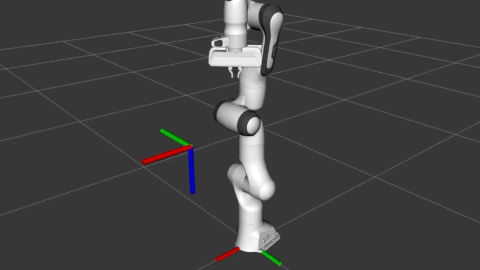

# Project Overview

### Contents
1. [Proposal Objectives](#Objectives-from-Proposal)
2. [Videos](#Videos)
3. [Future Work](#Ongoing-Work)
4. [Links](#Links-to-Completed-Work)

### Organization
[MoveIt](https://moveit.ros.org)

### Mentors
Tyler Weaver and Andy Zelenak, both at [PickNik](https://picknik.ai)

### The Project
This project centered around the [`moveit_servo` package](https://github.com/ros-planning/moveit2/tree/master/moveit_ros/moveit_servo), formerly known as `moveit_jog_arm`. The package is a velocity-streaming controller for robotic manipulators that converts user commands in an arbitrary input frame into joint commands for the robot. I generated a technical overview of `moveit_servo` during the summer, which may be found [here](https://github.com/AdamPettinger/moveit2/blob/gsoc-final_work/moveit_ros/moveit_servo/doc/servo_tutorial.md).

The project had a number of objectives laid out in the proposal which are discussed in detail in the next section, but broadly fall into 2 categories:

1. Port `moveit_servo` from ROS1 to ROS2
2. Make improvements to `moveit_servo`

I completed many of the individual objectives, but some are still ongoing work.

# Objectives from Proposal
The following describe the objectives accepted in the proposal for the project
### Main Objectives

1. Write a C++ only implementation of `moveit_servo`
2. Write a ROS2 wrapper for the C++ implementation, completing the port to ROS2

### Secondary Objectives

1. Make `moveit_servo` easier to use and set up on a new robot
2. Allow and implement different IK methods
3. Allow different sources of the Jacobian matrix
4. Improved performance and faster loop rates
5. Writing more comprehensive tests

### Objective Status
| Objective        | Status           | Links  |
| :-------------: |:-------------:| :-----:|
| Write a C++ only implementation of `moveit_servo`     | Dropped / Combined with the below |
| Write a ROS2 wrapper for the C++ implementation, completing the port to ROS2      | Complete and merged |   [Pull Request](https://github.com/ros-planning/moveit2/pull/248) |
| Make `moveit_servo` easier to use and set up on a new robot | Resources added, but could be better | [Quick Start Guide](https://github.com/AdamPettinger/moveit2/blob/gsoc-final_work/moveit_ros/moveit_servo/doc/running_the_demos.md), [Setup Guide](https://github.com/AdamPettinger/moveit2/blob/gsoc-final_work/moveit_ros/moveit_servo/doc/servo_tutorial.md) |
| Allow and implement different IK methods | In progress, likely into ROS1 instead of ROS2 |
| Allow different sources of the Jacobian matrix | Dropped |
| Improved performance and faster loop rates | Progress prior to my start | [Pull Request](https://github.com/ros-planning/moveit/pull/2103) |
| Writing more comprehensive tests | Complete | Part of this [Pull Request](https://github.com/ros-planning/moveit2/pull/248)  |

# Videos
### Videos of the demonstrations

### Other Videos
Damped Least Squares work

[MoveIt Servo feature overview](https://www.youtube.com/watch?v=MF-_XKpGefY)

# Ongoing Work and To-Do's
### Ongoing Work
Items currently in progress include:

1. **Objective: Allow and implement different IK methods.** I am currently experimenting with using Damped Least Squares as the IK method when the normal Singular-Value-Decomposition-based Inverse Jacobian method breaks down due to singularity in the Jacobian matrix. The idea is to allow the manipulator to move while very close to a kinematic singularity, at the expense of deviating slightly from the exact user input. Once working, this will likely be implemented on the ROS1 side, and may be added as a user option, or the whole IK method may be allowed to be a plugin and Damped Least Squares would be one available plugin

### To-Do's
Current To-Do's include:

1. **Objective: Allow different sources of the Jacobian matrix.** For non-serial manipulators to use `moveit_servo`
2. Running `moveit_servo` with ROS2 on a real robot
3. The [main PR](https://github.com/ros-planning/moveit2/pull/248) for the project had a couple of refactoring changes to move functionality out of `moveit_servo` and into other parts of MoveIt

# Links to Completed Work
The below table lists everything I have generated as part of this project

| Link | Description |
| :-------------: |:-------------:|
| [Main PR for the ROS2 port](https://github.com/ros-planning/moveit2/pull/248) | Contains almost all of the work for porting to ROS2 and adding tests + documentation |
| [Issue for tracking the port](https://github.com/ros-planning/moveit2/issues/206) | Main issue for tracking my GSoC work in the `moveit2` repo |
| [PR to fix tests](https://github.com/ros-planning/moveit2/pull/258) | Minor changes to make the tests less flaky |
| [Duplicate Node issue](https://github.com/ros-planning/moveit2/issues/252) | Issue where demo's have multiple copies of nodes using `planning_scene_monitor` |
| [PR into control_msgs](https://github.com/ros-controls/control_msgs/pull/47) | Ported `control_msgs/JointJog` message to ROS2 |
| [ROS1 PR for pre-port improvements](https://github.com/ros-planning/moveit/pull/2151) | Contains some fixes and improves to `moveit_jog_arm` before the renaming and porting |
| [PR to move and rename to Servo](https://github.com/ros-planning/moveit/pull/2165) | Changed `moveit_experimental/moveit_jog_arm` to `moveit_ros/moveit_servo` |
| [PR for ROS1 changes found from ROS2 work](https://github.com/ros-planning/moveit/pull/2249) | Backports some changes/fixes found from doing the ROS2 port/improvement |
| [PR fixing duplicate nodes in demos](https://github.com/ros-planning/moveit2/pull/262) | Fixes the issue below |
| [Issue for duplicate nodes](https://github.com/ros-planning/moveit2/issues/252) | Found bug affecting `moveit_servo` with duplicate nodes in demos |
| [Google Doc for Proposal](https://docs.google.com/document/d/1lFwhO4C6Rdo6YalJqUsw4Lmw-wcUA1jTHbI8vwB1KYE/edit?usp=sharing) | My GSoC Proposal |
| [ROS Discourse proposal](https://discourse.ros.org/t/gsoc-2020-porting-jog-arm-to-ros2-with-improvements/13388) | My initial proposal on ROS Discourse |
